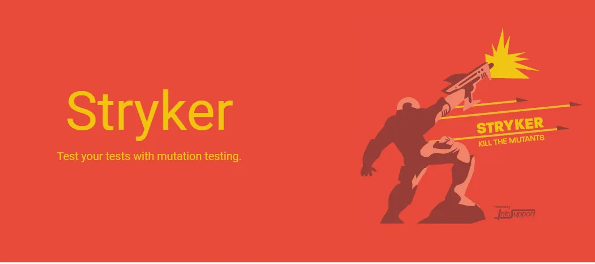

## Testes de Mutação com Stryker

<div align="center">
  
</div>

### O que é Teste de Mutação?

Teste de mutação é uma técnica avançada de teste de software que avalia a qualidade dos testes existentes no código. Ele funciona introduzindo pequenas alterações (ou "mutações") no código-fonte e verificando se os testes conseguem detectar essas alterações. Se os testes falharem ao detectar uma mutação, isso indica que o teste pode não ser robusto o suficiente ou que há áreas do código não cobertas pelos testes.

A importância dos testes de mutação está em garantir que os testes não apenas existem, mas também são eficazes em capturar possíveis erros no código. Isso ajuda a melhorar a confiabilidade do software e a identificar lacunas na cobertura de testes.

---

### Como configurar e executar os testes de mutação

Siga os passos abaixo para instalar as dependências e executar os testes de mutação neste projeto:

#### 1. Pré-requisitos
- Certifique-se de ter o [Node.js](https://nodejs.org/) instalado na versão 20 ou superior.
- Um gerenciador de pacotes como `npm` (instalado junto com o Node.js).

#### 2. Instalar as dependências
No diretório raiz do projeto, execute o seguinte comando para instalar todas as dependências necessárias:

```bash
npm install
```

#### 3. Executar os testes de mutação
Para rodar os testes de mutação utilizando o Stryker, execute o comando abaixo:

```bash
npm run test_mutation
```

#### 4. Visualizar o relatório de mutação
Após a execução dos testes de mutação, um relatório será gerado no diretório `./reports/mutation`. Você pode abrir o arquivo `index.html` neste diretório para visualizar os resultados no navegador.

---

### Estrutura do Relatório de Mutação

O relatório gerado pelo Stryker fornece informações detalhadas sobre:

- **Mutantes criados**: Alterações feitas no código.
- **Mutantes detectados**: Mutantes que foram capturados pelos testes.
- **Mutantes sobreviventes**: Mutantes que não foram detectados, indicando possíveis lacunas nos testes.
- **Cobertura de código**: Percentual de código coberto pelos testes.

O relatório é uma ferramenta essencial para identificar áreas do código que precisam de mais atenção nos testes.